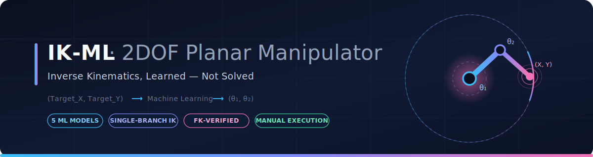
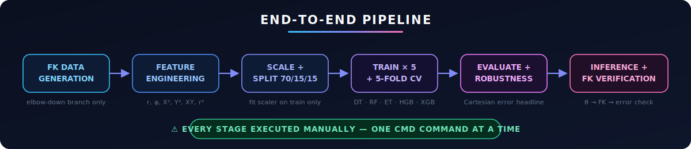
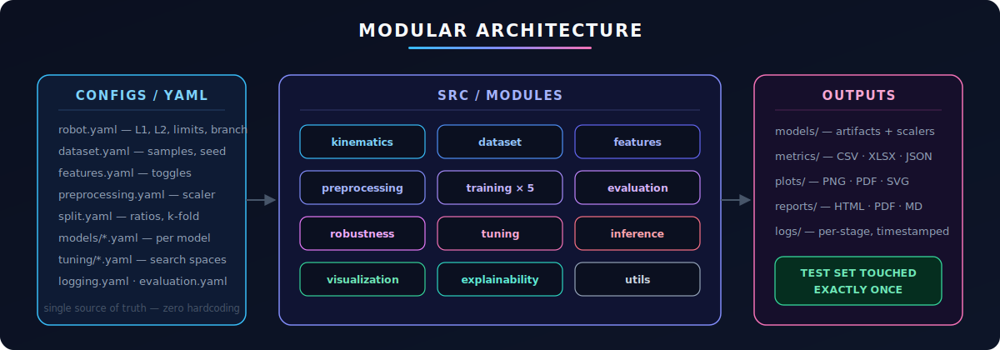

<div align="center">



<br/>

[](https://www.python.org/)
[](https://scikit-learn.org/)
[](https://xgboost.readthedocs.io/)
[](https://optuna.org/)
[](LICENSE)

**Learning Inverse Kinematics instead of solving it.**
A production-grade Machine Learning framework utilizing five tree-based regressors to predict joint angles `(θ₁, θ₂)` directly from target coordinates `(X, Y)` and robot physical dimensions `(L1, L2)`. 

[Philosophy](#-philosophy) · [Architecture](#-architecture) · [The Branch Problem](#-the-branch-problem) · [Models](#-models) · [Execution Guide](#-execution-pipeline)

</div>

---

## ✦ Philosophy

A 2DOF planar manipulator possesses a closed-form analytical Inverse Kinematics (IK) solution, making it the perfect, fully-verifiable benchmark for **learned** IK systems. Because Forward Kinematics (FK) is exact, every ML prediction is pushed back through the FK engine and scored strictly in **task space** (Cartesian error), bridging the gap between data-driven joint predictions and physical reality.

> [!IMPORTANT]
> **Strictly Supervised Learning**
> This repository strictly prohibits optimization-based IK solvers (Jacobian Pseudo-inverse, CCD, FABRIK, etc.). It is a pure supervised machine learning pipeline designed to achieve millimetre-level Cartesian accuracy in a single forward pass.

<div align="center">

</div>

---

## 🏗 Architecture

The framework is decoupled into independent, highly modular vertical slices. No monolithic scripts; every module is configurable via YAML and interacts strictly through standardized data APIs.

<div align="center">

</div>

### Core Subsystems
- **Kinematics Engine:** The single source of truth for Forward Kinematics. Never re-derived, imported everywhere.
- **Data Generator:** Synthesizes millions of configurations, dynamically varying `(X, Y)` targets and `(L1, L2)` physical geometries to train a true **Universal** IK model.
- **Model Training:** Automated pipelines with built-in Cross-Validation, preventing data leakage by fitting scalers exclusively on training splits.
- **Evaluation & Diagnostics:** Comprehensive Cartesian error tracking, robustness testing (noise injection, singularity proximity), and SHAP explainability.

---

## 🧭 The Branch Problem

The most critical challenge in ML-driven IK is the mapping ambiguity: a single `(X, Y)` coordinate admits **two valid joint configurations** (Elbow-Up and Elbow-Down). Training a regressor indiscriminately on both branches forces the model to learn their average—a mathematically invalid joint state that reaches neither target.

> [!NOTE]  
> **Resolution Protocol**
> We enforce single-branch fidelity at the point of data generation. Joint limits are explicitly clamped via `configs/robot.yaml` (e.g., `θ₂ ∈ [0, π]` for Elbow-Down) guaranteeing mathematically consistent dataset distributions. 

---

## 🤖 Models & Tuning

We evaluate five distinct tree-based architectures. The performance hierarchy leverages algorithms equipped with native multi-output regression capabilities to capture the physical coupling between `θ₁` and `θ₂`.

1. **Decision Tree:** Interpretable baseline.
2. **Random Forest:** Variance-reduced ensemble.
3. **Extra Trees:** High-randomization ensemble.
4. **HistGradientBoosting:** High-speed histogram binning.
5. **XGBoost:** The flagship model utilizing native `multi_output_tree` architecture.

> [!TIP]
> **Bayesian Optimization**
> We employ `Optuna` to conduct intelligent, autonomous hyperparameter space exploration. Optuna is utilized exclusively for tuning model capacity (learning rates, depths), never for iteratively solving the IK problem itself.

---

## 📊 Comprehensive Analytics Suite

The framework features an automated, massive analytics engine under `src/analytics/` capable of generating over 70 distinct visual insights, cleanly compiled into high-resolution PDFs.

- **Data Profiling:** KDE distributions, Clustered Correlation Heatmaps, Pair Plots, and PCA/t-SNE dimensionality reduction.
- **Diagnostic Arrays:** Bias-Variance Tradeoff charts, Actual vs. Predicted manifolds, and Residual Density Histograms.
- **Robotics Visualization:** Workspace Reachability Maps, Density Heatmaps, and Joint Space scatters.

---

## 🕹 Execution Pipeline

> [!WARNING]
> **Manual Execution Enforcement**
> To maintain strict control over computational resources, there are no automated build scripts. Every stage must be executed manually in dependency order.

### 1. Data Generation & Preprocessing
```cmd
python -m src.dataset.generate_dataset
python -m src.preprocessing.run_preprocessing
```

### 2. Training & Tuning
```cmd
python -m src.training.train_xgboost
python -m src.tuning.tune_models
```

### 3. Evaluation & Diagnostics
```cmd
python -m src.comparison.compare_models
python -m src.analytics.run_all
```

### 4. Universal Inference
Supply the physical geometry (`l1`, `l2`) alongside the target coordinates (`x`, `y`) to instantly predict the optimal joint configuration:
```cmd
python src\inference\predict.py --x 1.2 --y 0.8 --l1 1.0 --l2 1.0 --model xgboost
```

---

## ⚙️ Configuration

Control the entire framework without touching Python source code. All tunable parameters exist within the `configs/` directory.

**Robot Geometry & Kinematics** (`configs/robot.yaml`)
```yaml
link_lengths:
  l1: [0.5, 2.0]  # First link dynamic generation range
  l2: [0.5, 2.0]  # Second link dynamic generation range
joint_limits:
  q1: [-3.14159, 3.14159]
  q2: [0.0, 3.14159] # Enforces Elbow-Down branch
```

**Dataset Parameters** (`configs/dataset.yaml`)
```yaml
total_samples: 1000000
random_seed: 42
```

---

<div align="center">
<br/>

**`(X, Y, L1, L2)` → Universal Model → `(θ₁, θ₂)` → FK-Verified → ✓**

<sub>Engineered for Research and Production Environments · 2026</sub>

</div>
